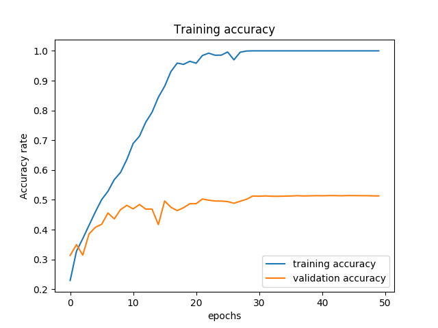
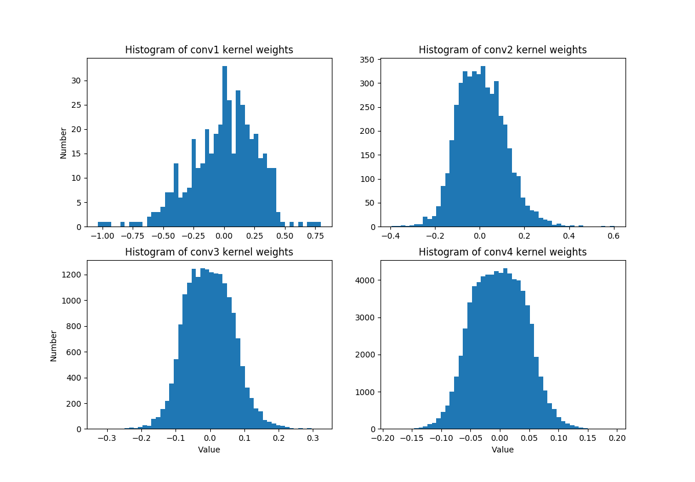
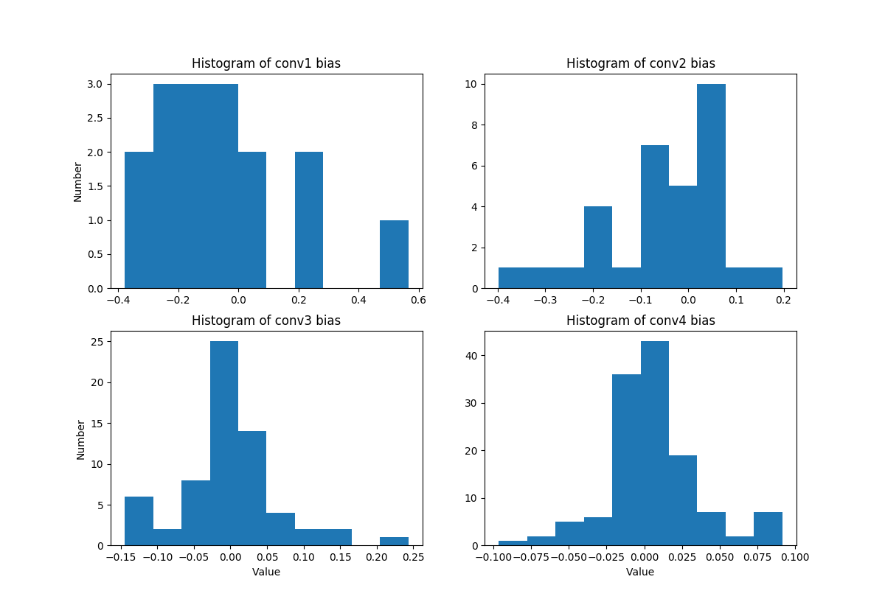
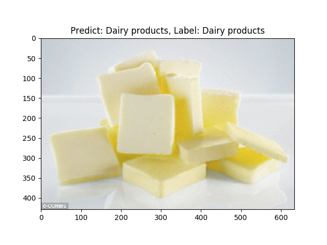
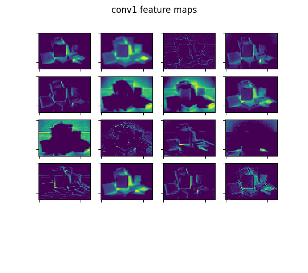
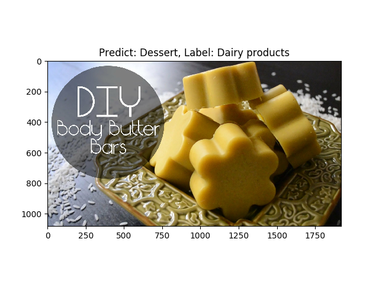
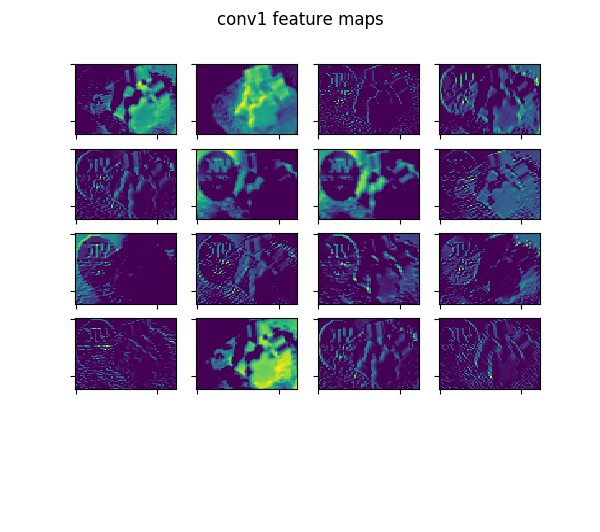

# Homework 2 for Deep Learning

## Environment

I have test it on different machines, so it's a little complicated.
* ubuntu 16.04 LTS
* python3.5.2 or python3.6
* tensorflow 1.4.1 or 1.7.0
* GPU: Tesla P100

### CNN for Image Recognition

In this task, I construct a 4-layer CNN to predict the label of [Food-11 Dataset](https://mmspg.epfl.ch/food-image-datasets).
I used tensorflow high level api Dataset to read the image and do some preprocessing.
The detailed implementation can be seen in [cnn_train_slow.py](cnn_train_slow.py) and [cnn_train_fast.py](cnn_train_fast.py).
By specified the directory where you put the images, you can use above two files to train the model.
After training it will generate training curve and training accuracy, and some model meta data.

Use [plot_model.py](plot_model.py) to visualize the distribution of model weights and bias.
Be aware to specified the meta files directory.

Use [feature_map.py](feature_map.py) to compute the model confusion matrix evaluated on evaluation data, 
display some recognition results and hidden features of each layer.

### RNN for Language Model

