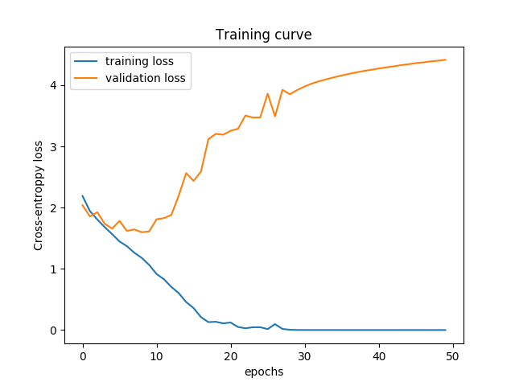

# Homework 2 for Deep Learning

## Environment

I have test it on different machines, so it's a little complicated.
* ubuntu 16.04 LTS
* python3.5.2 or python3.6
* tensorflow 1.4.1 or 1.7.0
* GPU: Tesla P100

### CNN for Image Recognition

In this task, I construct a 4-layer CNN to predict the label of [Food-11 Dataset](https://mmspg.epfl.ch/food-image-datasets).
I used tensorflow high level api Dataset to read the image and do some preprocessing.
The detailed implementation can be seen in [cnn_train_fast.py](cnn_train_fast.py).
By specified the directory where you put the images, you can start to train the model.
After training it will generate training curve and training accuracy, and some model meta data.




Use [plot_model.py](plot_model.py) to visualize the distribution of model weights and bias.
Be sure to specified the meta files directory.


[feature_map.py](feature_map.py) will compute the model confusion matrix evaluated on evaluation data, 
display some recognition results and visualize hidden features of each layer.


### RNN for Language Model

In this task I construct a 2-layer RNN as character-level language model, 
and trained it on [The Complete Works of William Shakespeare](http://shakespeare.mit.edu/works.html).
After training, it will generate training curve and training error as usual, and some random generated words with starting text _Asuka_.


```
Start training ...
Epochs: 1, loss: 3.0935, acc: 0.1816, val_acc: 0.2798
Epochs: 2, loss: 2.6029, acc: 0.2727, val_acc: 0.3391
Epochs: 3, loss: 2.4404, acc: 0.3106, val_acc: 0.3770
Epochs: 4, loss: 2.3461, acc: 0.3331, val_acc: 0.3990
Epochs: 5, loss: 2.2806, acc: 0.3485, val_acc: 0.4104
.
.
.
Epochs: 36, loss: 1.8574, acc: 0.4568, val_acc: 0.5299
Epochs: 37, loss: 1.8539, acc: 0.4577, val_acc: 0.5316
Epochs: 38, loss: 1.8497, acc: 0.4588, val_acc: 0.5340
Epochs: 39, loss: 1.8449, acc: 0.4600, val_acc: 0.5339
Epochs: 40, loss: 1.8419, acc: 0.4609, val_acc: 0.5358
Asukallen and the strong of the sease,
That they are so the strong of the court shall be thee,
The strong of the senter of the sealth of thee,
The strong of the senter of the sealth of thee,
The strenger of the sease of the court shall be thee,
The strenger of the sease of the court shall be thee,
The strenger of the sease of the court shall be thee,
The strenger of the sease of the court shall be thee,
The strenger of the sease of the court shall be thee,
The strenger of the sease of the court shall
Time cost: 3:09:49

```
